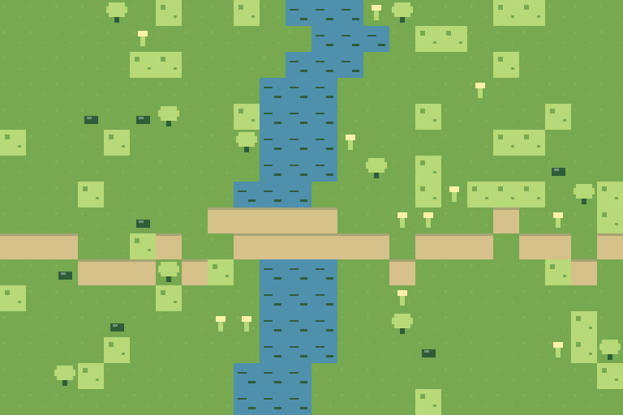

# Mapsoo Worldsmith

> Open-source world asset generator for Godot creators.

[](https://github.com/babyrush0101-source/mapsoo-kids/actions/workflows/ci.yml)
[](https://github.com/babyrush0101-source/mapsoo-kids/actions/workflows/pages.yml)

[Live demo](https://babyrush0101-source.github.io/mapsoo-kids/) · [v0.1.0-alpha.2 release](https://github.com/babyrush0101-source/mapsoo-kids/releases/tag/v0.1.0-alpha.2) · [First-import feedback](https://github.com/babyrush0101-source/mapsoo-kids/issues/12)

Mapsoo Worldsmith is evolving from the original `mapsoo-kids` website into a local-first tool that turns a compact world specification into a previewable, versioned game-art asset pack. The first target is a complete path from world settings to a Godot-friendly ZIP that can also be published on itch.io.

## Project status

The public `main` branch and **v0.1.0-alpha.2 pre-release** provide the current immutable public baseline. Alpha.2 keeps the same account-free, backend-free, API-key-free loop and upgrades the default export to a runner-verifiable receipt:

1. Edit a compact World Spec for meadow, desert, or snowfield worlds.
2. Generate the same starter tiles and map again from the same seed.
3. Preview the pixel-art result in the browser and review validation issues.
4. Download/load a World Spec JSON, or load the strict synthetic STOYO Asset Request example and project it locally.
5. Export an executable-free 12-file ZIP containing PNG atlases, a map preview, three schemas, manifest, receipt 0.2, and asset license.

The versioned starter input is available at [`examples/sunny-meadow.world.json`](examples/sunny-meadow.world.json). The privacy-minimized STOYO integration fixture is [`examples/integrations/stoyo/river-valley-asset-request.json`](examples/integrations/stoyo/river-valley-asset-request.json).

Local World Spec and STOYO Asset Request imports share the same 128 KiB cap, strict UTF-8 decoding, duplicate-key detection, bounded JSON depth/complexity, safe-number checks, forbidden prototype-key checks, and strict schema/runtime validation. A STOYO request is first projected to a World Spec with a canonical SHA-256 binding; initial generation, editor generation, and both import paths then run through the same validated provider runner. A newer user action aborts and supersedes older work, so a failed or stale request never replaces the last successful world.



The committed [Sunny Meadow alpha.2 fixture](examples/packs/sunny-meadow-v0.1.0-alpha.2/) was captured from the real default browser exporter. It has 12 files, 11 manifest payload records, and fixed SHA-256 `8c7720a8578cdc276ff69677ed0d64d8a1524d32fd00da0ffb8035b5a52bfcb6`. A pinned pure-JavaScript PNG encoder removes browser-native PNG compression drift, and CI runs the real browser exporter before passing the byte-identical canonical ZIP to both Godot 4.3 and 4.7 jobs.

The published [v0.1.0-alpha.2 release](https://github.com/babyrush0101-source/mapsoo-kids/releases/tag/v0.1.0-alpha.2) is tagged at commit `072a7b8`. Its [release workflow](https://github.com/babyrush0101-source/mapsoo-kids/actions/runs/29674040991) rebuilt the fixed pack, passed the exact attachment audit, and imported that same pack in [Godot 4.3](https://github.com/babyrush0101-source/mapsoo-kids/actions/runs/29674040991/job/88158028238) and [Godot 4.7](https://github.com/babyrush0101-source/mapsoo-kids/actions/runs/29674040991/job/88158028241). All 11 public attachment digests are pinned in the immutable release registry.

The ZIP uses engine-neutral PNG and JSON as its source of truth and intentionally contains no executable addon code. Install the MIT-licensed importer only from this official repository (or the Godot Asset Library once published), then select the extracted pack's `mapsoo.manifest.json`; it derives a `TileSet`, `TileMapLayer` scene, and prop sprites under `res://mapsoo_imports/`. The importer and example project have headless smoke coverage on Godot 4.3 and 4.7; alpha.2 additionally makes import of the exact fixed-hash release pack a required matrix gate. SHA-256 records verify pack consistency, not publisher identity, so never enable scripts copied from a third-party asset pack.

## First Godot import

The public first-user path is intentionally short and version-bound:

1. Download the audited [Sunny Meadow asset ZIP](https://github.com/babyrush0101-source/mapsoo-kids/releases/download/v0.1.0-alpha.2/mapsoo-sunny-meadow-v0.1.0-alpha.2.zip).
2. Download the separate [Godot importer ZIP](https://github.com/babyrush0101-source/mapsoo-kids/releases/download/v0.1.0-alpha.2/mapsoo-godot-importer-v0.1.0-alpha.2.zip) from the same release.
3. Follow the bilingual [10-minute first-import guide](docs/10_FIRST_GODOT_IMPORT.md).
4. Submit either success or failure through the [structured feedback form](https://github.com/babyrush0101-source/mapsoo-kids/issues/new?template=first-import-feedback.yml).

The expected generated scene is `res://mapsoo_imports/sunny-meadow/sunny-meadow.world.tscn`. The guide pins both download hashes and explains the current derived-output/re-import boundary.

## Why this order

Image generation alone does not make a usable game-asset pipeline. Mapsoo first makes the asset contract, validation, reproducibility, preview, and export reliable. The Workbench now routes its initial, edited, imported World Specs, and projected STOYO requests through the provider SDK, atomically stores a deeply frozen runner-owned world/evidence result, exposes the Provider snapshot that produced it, and keeps only the latest request eligible to update the preview. The legacy exporter rejects bare worlds and optional AI providers; full receipt/manifest projection enters a new versioned pack rather than rewriting the published alpha.

The registered alpha.2 release binds runner-owned evidence and actual World Spec bytes into receipt `0.2.0`; the manifest derives time, input binding, license, and provenance from the shipped canonical receipt. A version-bound Node verifier rejects cross-version policies and 31 semantic mutation cases, while both published alpha fixtures and their public attachment hashes remain immutable. AI-provider publication remains fail-closed: the current export policy authorizes only the exact source-free CC0 built-in procedural profile.

Release tooling now resolves `package.json` through a fail-closed, immutable version registry. That registry selects the exact fixture, release inputs, itch.io page/media, and receipt policy; CI also rebuilds every published example pack and compares it with its pinned public SHA-256. Every GitHub attachment digest for a published tag is pinned, and the builder refuses to overwrite that tag—continued development must use a new candidate version.

## Documentation

- [Master plan](docs/00_MASTER_PLAN.md)
- [Product and MVP specification](docs/01_PRODUCT_AND_MVP.md)
- [Technical architecture](docs/02_TECHNICAL_ARCHITECTURE.md)
- [Asset and export specification](docs/03_ASSET_AND_EXPORT_SPEC.md)
- [Roadmap](docs/04_ROADMAP.md)
- [Open-source and Codex OSS readiness](docs/05_OPEN_SOURCE_READINESS.md)
- [Security and migration audit](docs/06_SECURITY_AND_MIGRATION.md)
- [STOYO integration](docs/07_STOYO_INTEGRATION.md)
- [Executable STOYO Asset Request contract](integrations/stoyo/README.md)
- [GitHub, itch.io, and Codex for OSS release kit](docs/08_RELEASE_ITCH_AND_OSS_KIT.md)
- [Generation Provider SDK](docs/09_PROVIDER_SDK.md)
- [10-minute first Godot import](docs/10_FIRST_GODOT_IMPORT.md)
- [Deterministic itch.io release visuals](docs/release-visuals/README.md)
- [Verified itch.io operator upload kit](docs/itch-kit/README.md)
- [75-second evidence video source and verification](video/README.md)
- [v0.1.0-alpha.1 release notes](docs/releases/v0.1.0-alpha.1.md)
- [v0.1.0-alpha.2 release notes](docs/releases/v0.1.0-alpha.2.md)
- [v0.1.0-alpha.2 release visual source](docs/release-visuals/README-v0.1.0-alpha.2.md)

The reviewed [silent bilingual 75-second MP4](docs/media/v0.1.0-alpha.1/video/mapsoo-worldsmith-v0.1.0-alpha.1-75s.mp4) remains an immutable alpha.1 [GitHub release asset](https://github.com/babyrush0101-source/mapsoo-kids/releases/download/v0.1.0-alpha.1/mapsoo-worldsmith-v0.1.0-alpha.1-75s.mp4). Alpha.2 does not rename or reuse it as evidence.

## Local development

Requirements: Node.js 20+ and pnpm 11+.

```bash
pnpm install
pnpm dev
```

Run the complete local verification before contributing:

```bash
pnpm check
pnpm security:audit
pnpm release:history:remote
pnpm release:browser:verify
```

`pnpm check` is the deterministic offline project gate and includes the production-license notice verifier. The audit checks both the current app and historical alpha.1 video lockfiles against the package registry. The final two commands confirm both immutable public GitHub releases and execute the current exporter in a real browser, comparing its raw ZIP bytes with the registered alpha.2 pack.

After registering and selecting a future unpublished version, build, validate, and reproduce its complete candidate release bundle:

```bash
pnpm release:local
```

The command intentionally refuses to rebuild a version whose lifecycle is already `published`. To inspect a published release, download its attachments into the configured release directory and run `pnpm release:verify`; every attachment must match the pinned GitHub digest. Start a new candidate version for any changed output.

Build the exact itch.io operator directory—including the executable-free asset ZIP, itch-specific checksum, page metadata/copy, cover, five screenshots, and byte manifest:

```bash
pnpm release:itch
```

Candidate GitHub files are written to `release/v<version>/`; the separate itch.io operator kit is written to `release/itch/v<version>/`. The itch kit intentionally excludes the importer and preserves page visibility as `Draft` until the maintainer previews the real page. An explicit matching version tag creates a GitHub release **draft** only after the branch has been reviewed and merged; the maintainer then deliberately publishes the verified prerelease. The public alpha was produced through that path and is now protected from rebuilding.

No environment variables are required for the portable alpha. See [`.env.example`](.env.example) for the key-handling policy before adding a future provider.

The old marketing website is not part of the new product. Its history remains available in Git, while the active source tree is being rebuilt as the Worldsmith workbench.

## License

Source code is licensed under the [MIT License](LICENSE). Generated packs and bundled examples carry their own license metadata; do not assume that every imported or generated image is MIT-licensed.
