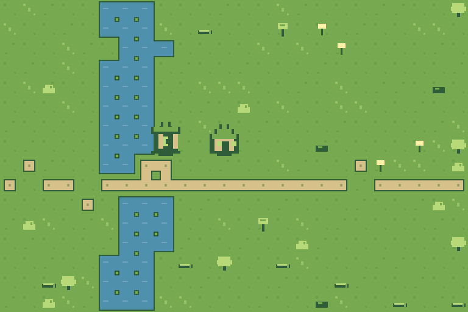

# Mapsoo Worldsmith

> Open-source world asset generator for Godot creators.

[](https://github.com/babyrush0101-source/mapsoo-kids/actions/workflows/ci.yml)
[](https://github.com/babyrush0101-source/mapsoo-kids/actions/workflows/pages.yml)

[Live demo](https://babyrush0101-source.github.io/mapsoo-kids/) · [v0.1.0-alpha.6 public release](https://github.com/babyrush0101-source/mapsoo-kids/releases/tag/v0.1.0-alpha.6) · [Alpha.6 release notes](docs/releases/v0.1.0-alpha.6.md) · [First-import feedback](https://github.com/babyrush0101-source/mapsoo-kids/issues/12)

Mapsoo Worldsmith is evolving from the original `mapsoo-kids` website into a local-first tool that turns a compact world specification into a previewable, versioned game-art asset pack. The first target is a complete path from world settings to a Godot-friendly ZIP that can also be published on itch.io.

## Project status

The **v0.1.0-alpha.6 prerelease** is the current immutable public baseline. It keeps the account-free, backend-free, API-key-free loop and extends Alpha.5 semantic places with optional place-linked exterior structures:

1. Edit a compact World Spec for meadow, desert, or snowfield worlds.
2. Generate the same 3 ground variants, 16 water masks, 16 road masks, 6 prop sprites, and map again from the same seed.
3. Preview the layered pixel-art result in the browser and review validation issues.
4. Download/load a World Spec JSON, or load the strict synthetic STOYO Asset Request example and project it locally.
5. Export an executable-free 18-file ZIP containing PNG atlases, Ground/Water/Roads/Props data, semantic-place and structure metadata, a map preview, five schemas, manifest, receipt 0.2, and asset license.

Alpha.5 adds World Spec 0.2 semantic places, a canonical `runtime/places.json` sidecar, six reusable place markers, a browser overlay/list, and Godot `Marker2D` anchors. Its real-browser ZIP has 15 files, four schemas, and SHA-256 `8d86124a4a37fa4a78487c4e91cb7f5024561f140814a5fd139c5b93fde54f36`; the exact published pack imports as `created → unchanged` in the Linux/Windows Godot 4.3/4.7 release matrix. All 12 public attachment digests are pinned in the immutable release registry.

Alpha.6 adds optional place-linked exterior structures, four deterministic archetypes, `runtime/structures.json`, a transparent structures atlas, browser structure controls, and managed Godot `Sprite2D` derivation. Its published 18-file real-browser fixture has SHA-256 `4563552187977b38cdba86c7d3cbf5429a67b7a0a6049e978c2ef2992ef3a054`. The separate importer ZIP has SHA-256 `bbfacd2b5c8503214b7647d59e9911a34fa1b4e073f86bd1310686812c9142c0`. itch.io upload remains postponed; no STOYO production adoption, independent user report, or external adoption is claimed.

Alpha.7 is the current audited candidate. The Workbench gallery can generate Sunny Meadow, Dustwind Outpost, and Frostwatch Vale as three independent Pack Schema 0.5 ZIPs. Their real-browser bytes are pinned in the candidate registry and the same exact packs must pass `created → unchanged → conflict preserved` on Linux/Windows with Godot 4.3/4.7 before the public-release ledger advances. Until that publication finishes, all public download links intentionally remain on immutable Alpha.6.

The current public starter input is [`examples/sunny-meadow-v0.3.world.json`](examples/sunny-meadow-v0.3.world.json); earlier Alpha.4/Alpha.5 inputs remain available for historical verification. The privacy-minimized STOYO integration fixture is [`examples/integrations/stoyo/river-valley-asset-request.json`](examples/integrations/stoyo/river-valley-asset-request.json).

Local World Spec and STOYO Asset Request imports share the same 128 KiB cap, strict UTF-8 decoding, duplicate-key detection, bounded JSON depth/complexity, safe-number checks, forbidden prototype-key checks, and strict schema/runtime validation. A STOYO request is first projected to a World Spec with a canonical SHA-256 binding; initial generation, editor generation, and both import paths then run through the same validated provider runner. A newer user action aborts and supersedes older work, so a failed or stale request never replaces the last successful world.



The committed [Sunny Meadow alpha.6 fixture](examples/packs/sunny-meadow-v0.1.0-alpha.6/) was captured from the real browser exporter after the pack-schema 0.4 contract was finalized. It has 18 files, 17 manifest payload records, 3 semantic places, 2 placed structures, and fixed SHA-256 `4563552187977b38cdba86c7d3cbf5429a67b7a0a6049e978c2ef2992ef3a054`.

The older published Alpha.1–Alpha.5 fixtures and hashes remain immutable. A pinned pure-JavaScript PNG encoder removes browser-native PNG compression drift, and CI runs the real browser exporter before passing the byte-identical canonical ZIP to the Godot matrix.

The published [v0.1.0-alpha.6 release](https://github.com/babyrush0101-source/mapsoo-kids/releases/tag/v0.1.0-alpha.6) is tagged at commit `315bc1b`. Its successful [release workflow](https://github.com/babyrush0101-source/mapsoo-kids/actions/runs/29685960441) rebuilt the fixed pack, passed the exact 13-attachment audit, and imported that same pack in the Linux/Windows × Godot 4.3/4.7 release matrix.

The ZIP uses engine-neutral PNG and JSON as its source of truth and intentionally contains no executable addon code. Install the MIT-licensed importer only from this official repository (or the Godot Asset Library once published), then select the extracted pack's `mapsoo.manifest.json`; schema 0.2 derives Ground, Water, and Roads `TileMapLayer` nodes, Props, two TerrainSets, and basic Water collision under `res://mapsoo_imports/`. Managed-resource ownership remains in `mapsoo.import-state.json`: identical clean input is `unchanged`, a clean source update is `updated`, and manual edits or legacy output without state fail closed as `conflict`. This is a terrain asset and import contract, not a complete game, navigation system, or production-readiness claim. SHA-256 records verify pack consistency, not publisher identity, so never enable scripts copied from a third-party asset pack.

## First Godot import

The public first-user path is intentionally short and version-bound:

1. Download the audited [Sunny Meadow asset ZIP](https://github.com/babyrush0101-source/mapsoo-kids/releases/download/v0.1.0-alpha.6/mapsoo-sunny-meadow-v0.1.0-alpha.6.zip) (`4563552187977b38cdba86c7d3cbf5429a67b7a0a6049e978c2ef2992ef3a054`).
2. Download the separate [Godot importer ZIP](https://github.com/babyrush0101-source/mapsoo-kids/releases/download/v0.1.0-alpha.6/mapsoo-godot-importer-v0.1.0-alpha.6.zip) (`bbfacd2b5c8503214b7647d59e9911a34fa1b4e073f86bd1310686812c9142c0`) from the same release.
3. Follow the bilingual [Alpha.6 first-import guide](docs/16_ALPHA6_FIRST_GODOT_IMPORT.md).
4. Submit either success or failure through the [structured feedback form](https://github.com/babyrush0101-source/mapsoo-kids/issues/new?template=first-import-feedback.yml).

The expected generated scene is `res://mapsoo_imports/sunny-meadow/sunny-meadow.world.tscn`. The guide pins both download hashes and explains the current derived-output/re-import boundary.

## Why this order

Image generation alone does not make a usable game-asset pipeline. Mapsoo first makes the asset contract, validation, reproducibility, preview, and export reliable. The Workbench now routes its initial, edited, imported World Specs, and projected STOYO requests through the provider SDK, atomically stores a deeply frozen runner-owned world/evidence result, exposes the Provider snapshot that produced it, and keeps only the latest request eligible to update the preview. The legacy exporter rejects bare worlds and optional AI providers; full receipt/manifest projection enters a new versioned pack rather than rewriting the published alpha.

The registered alpha.2 release introduced runner-owned evidence and actual World Spec byte binding in receipt `0.2.0`; alpha.3 added safe Godot re-import; alpha.4 uses a separately version-bound `procedural-terrain-v2@0.2.0` policy and pack schema 0.2 without changing any older published fixture or hash. AI-provider publication remains fail-closed: the current export policy authorizes only the exact source-free CC0 built-in procedural terrain profile.

Release tooling now resolves `package.json` through a fail-closed, immutable version registry. That registry selects the exact fixture, release inputs, itch.io page/media, and receipt policy; CI also rebuilds every published example pack and compares it with its pinned public SHA-256. Every GitHub attachment digest for a published tag is pinned, and the builder refuses to overwrite that tag—continued development must use a new candidate version.

## Documentation

- [Master plan](docs/00_MASTER_PLAN.md)
- [Product and MVP specification](docs/01_PRODUCT_AND_MVP.md)
- [Technical architecture](docs/02_TECHNICAL_ARCHITECTURE.md)
- [Asset and export specification](docs/03_ASSET_AND_EXPORT_SPEC.md)
- [Roadmap](docs/04_ROADMAP.md)
- [Open-source and Codex OSS readiness](docs/05_OPEN_SOURCE_READINESS.md)
- [Security and migration audit](docs/06_SECURITY_AND_MIGRATION.md)
- [STOYO integration](docs/07_STOYO_INTEGRATION.md)
- [Executable STOYO Asset Request contract](integrations/stoyo/README.md)
- [GitHub, itch.io, and Codex for OSS release kit](docs/08_RELEASE_ITCH_AND_OSS_KIT.md)
- [Generation Provider SDK](docs/09_PROVIDER_SDK.md)
- [10-minute first Godot import](docs/10_FIRST_GODOT_IMPORT.md)
- [Safe Godot re-import contract](docs/11_SAFE_GODOT_REIMPORT.md)
- [Deterministic itch.io release visuals](docs/release-visuals/README.md)
- [Verified itch.io operator upload kit](docs/itch-kit/README.md)
- [75-second evidence video source and verification](video/README.md)
- [v0.1.0-alpha.1 release notes](docs/releases/v0.1.0-alpha.1.md)
- [v0.1.0-alpha.2 release notes](docs/releases/v0.1.0-alpha.2.md)
- [v0.1.0-alpha.2 release visual source](docs/release-visuals/README-v0.1.0-alpha.2.md)
- [v0.1.0-alpha.3 release notes](docs/releases/v0.1.0-alpha.3.md)
- [v0.1.0-alpha.3 release visual source](docs/release-visuals/README-v0.1.0-alpha.3.md)
- [v0.1.0-alpha.4 design and acceptance](docs/12_ALPHA4_PLAYABLE_TERRAIN.md)
- [Alpha.5 semantic places scope and acceptance](docs/13_ALPHA5_SEMANTIC_PLACES.md)
- [v0.1.0-alpha.4 release notes](docs/releases/v0.1.0-alpha.4.md)
- [v0.1.0-alpha.4 release visual source](docs/release-visuals/README-v0.1.0-alpha.4.md)
- [v0.1.0-alpha.5 release notes](docs/releases/v0.1.0-alpha.5.md)
- [Alpha.6 exterior structures scope and acceptance](docs/15_ALPHA6_EXTERIOR_STRUCTURES.md)
- [v0.1.0-alpha.6 release notes](docs/releases/v0.1.0-alpha.6.md)
- [v0.1.0-alpha.6 deferred release visual source](docs/release-visuals/README-v0.1.0-alpha.6.md)
- [v0.1.0-alpha.6 first-import guide](docs/16_ALPHA6_FIRST_GODOT_IMPORT.md)
- [Alpha.7 multi-world gallery scope and acceptance](docs/17_ALPHA7_MULTI_WORLD_GALLERY.md)
- [v0.1.0-alpha.7 release notes](docs/releases/v0.1.0-alpha.7.md)
- [Community evidence ledger](docs/14_COMMUNITY_EVIDENCE.md)

## Community and contributing

Bug reports, feature proposals, and reproducible Godot import feedback are welcome through the repository [issue templates](https://github.com/babyrush0101-source/mapsoo-kids/issues/new/choose). Before opening a pull request, read [CONTRIBUTING.md](CONTRIBUTING.md); project decision and response boundaries are documented in [GOVERNANCE.md](GOVERNANCE.md), sensitive reports belong in the private path described by [SECURITY.md](SECURITY.md), and independent use is recorded only when it satisfies the public [community evidence ledger](docs/14_COMMUNITY_EVIDENCE.md). This is a volunteer-maintained project and does not offer an SLA.

The reviewed [silent bilingual 75-second MP4](docs/media/v0.1.0-alpha.1/video/mapsoo-worldsmith-v0.1.0-alpha.1-75s.mp4) remains an immutable alpha.1 [GitHub release asset](https://github.com/babyrush0101-source/mapsoo-kids/releases/download/v0.1.0-alpha.1/mapsoo-worldsmith-v0.1.0-alpha.1-75s.mp4). Alpha.2 does not rename or reuse it as evidence.

## Local development

Requirements: Node.js 20+ and pnpm 11+.

```bash
pnpm install
pnpm dev
```

Run the complete local verification before contributing:

```bash
pnpm check
pnpm security:audit
pnpm release:history:remote
pnpm release:browser:verify
```

`pnpm check` is the deterministic offline project gate and includes the production-license notice verifier. The audit checks both the current app and historical alpha.1 video lockfiles against the package registry. The final commands confirm all six immutable public GitHub releases and run the Alpha.2–Alpha.6 exporters in a real browser, comparing raw ZIP bytes with their independently registered fixtures.

After registering and selecting a future unpublished version, build, validate, and reproduce its complete candidate release bundle:

```bash
pnpm release:local
```

The command intentionally refuses to rebuild a version whose lifecycle is already `published`. To inspect a published release, download its attachments into the configured release directory and run `pnpm release:verify`; every attachment must match the pinned GitHub digest. Start a new candidate version for any changed output.

Build the exact version-configured itch.io Draft directory. Alpha.1–Alpha.4 retain their historical cover/screenshots; because Alpha.5 and Alpha.6 postpone itch publication, their Drafts contain only the executable-free asset ZIP, checksum, page metadata/copy, and byte manifest—no media and no upload:

```bash
pnpm release:itch
```

Candidate GitHub files are written to `release/v<version>/`; the separate itch.io operator kit is written to `release/itch/v<version>/`. The itch kit intentionally excludes the importer and preserves page visibility as `Draft` until the maintainer previews the real page. An explicit matching version tag creates a GitHub release **draft** only after the branch has been reviewed and merged; the maintainer then deliberately publishes the verified prerelease. The public alpha was produced through that path and is now protected from rebuilding.

No environment variables are required for the portable alpha. See [`.env.example`](.env.example) for the key-handling policy before adding a future provider.

The old marketing website is not part of the new product. Its history remains available in Git, while the active source tree is being rebuilt as the Worldsmith workbench.

## License

Source code is licensed under the [MIT License](LICENSE). Generated packs and bundled examples carry their own license metadata; do not assume that every imported or generated image is MIT-licensed.
